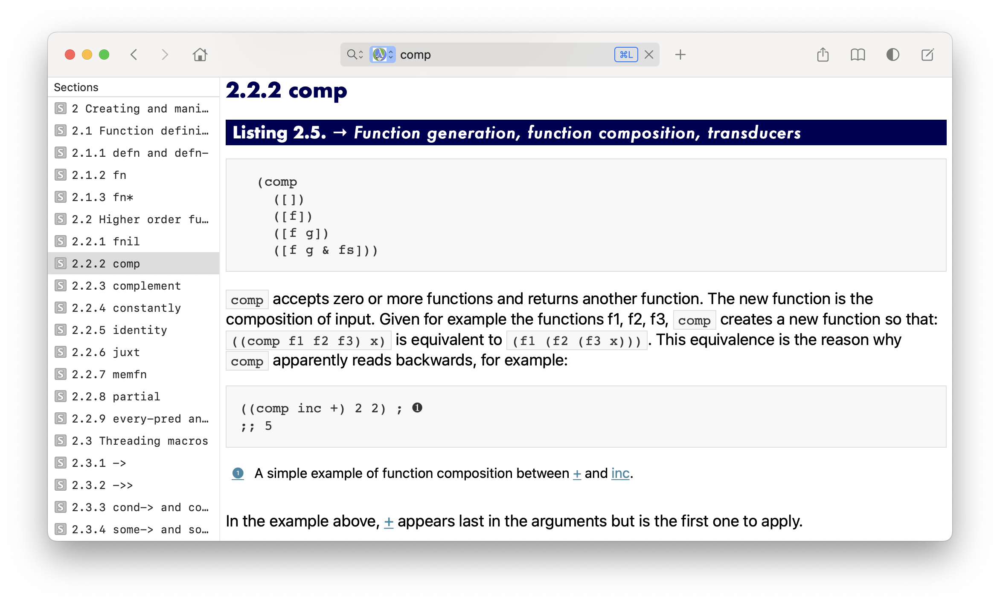

# *Clojure, The Essential Reference* (for Dash)

_[Clojure, The Essential Reference][book]_ is the most detailed API
reference for Clojure’s standard library, to date.

This repo allows you to quickly jump to any documentation entry in the book
using the popular API browser [Dash][dash].

For now, you must purchase the book’s `.epub` file, then use our script to convert
it to a Dash `.docset` file.



## Book Rationale

> “[Clojure] documentation exists in many forms and is overall very valuable,
> but it is fragmented: jumping between all the different sources is time
> consuming, including the fact that searching the right place it’s not always
> obvious.  One of the main goals of this book is to do that work on your
> behalf: bringing together all the valuable sources of information in a single
> accessible place.”
>
> “We think this book is a perfect fit for the intermediate or seasoned Clojure
> programmer who wants to understand how a function (and ultimately Clojure)
> works.“
>
> “It’s the hope of the authors that this book is going to be a de-facto
> reference to the standard library and it’s certainly our desire to provide
> the reader with one of the most comprehensive source of information about
> Clojure.”

## Docset features

* Every heading is indexed as a Docset “Section”.
* Every chapter has its own Docset page (most of the code in our script is for merging chapters split across files)
* Table of Contents sidebar for each chapter.

## Create the Docset

1. Buy the [book], and download the epub file to `book.epub`.
1. Use [Clojure CLI] to build the node.js file:

    ```
    ./build
    ```

1. Run the following to generate the docset:

    ```
    npm ci
    node docset.js
    ```

1. Import `docset/ClojureEssentialReference.docset` into Dash under Preferences > Docsets.

## See Also

An [Emacs Integration](https://github.com/p3r7/clojure-essential-ref) is
available for jumping to the web version of the book, or for reading the EPUB
file inside your editor.

It provides an [index of symbols referenced in the book][symbols] along with
all the URLs to the [online version][livebook] if you wish to browse/index
those instead of the EPUB file.

[clojure cli]:https://clojure.org/guides/getting_started
[dash]:https://kapeli.com/dash
[book]:https://www.manning.com/books/clojure-the-essential-reference
[symbols]:https://github.com/p3r7/clojure-essential-ref/blob/13ac560c25f7355fba00d9ca8c9f4ca03e7fd189/clojure-essential-ref.el#L50
[livebook]:https://livebook.manning.com/book/clojure-the-essential-reference/
